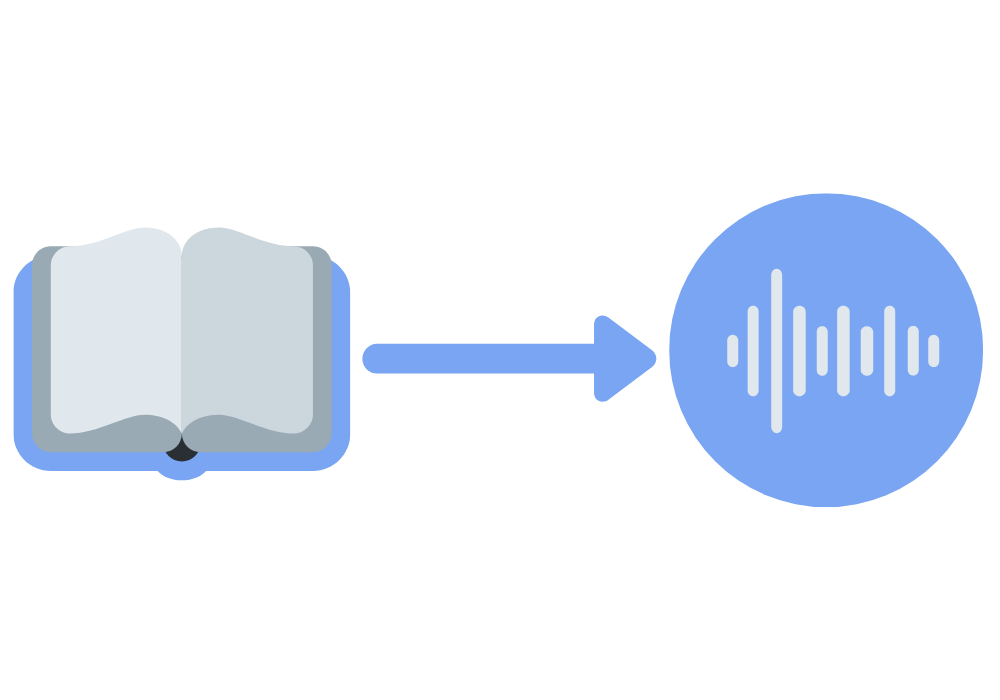
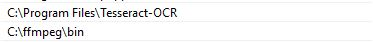
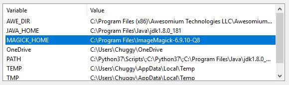
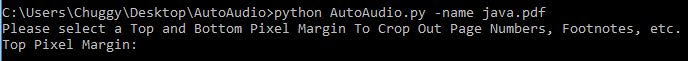
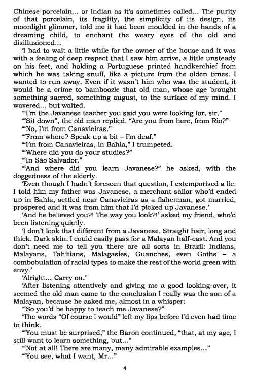
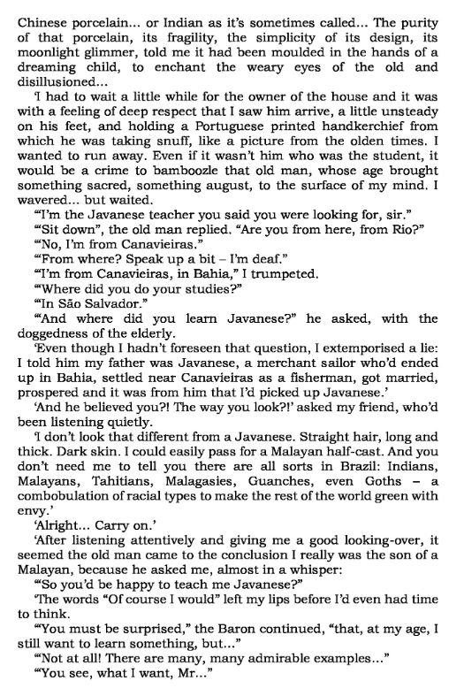
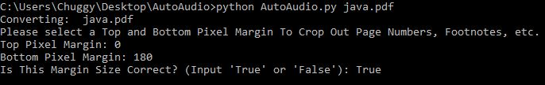
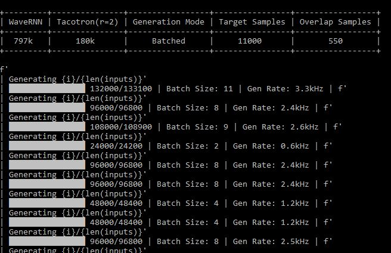

# AutoAudio 📻
This python project takes a standard PDF document as input, and using open source technologies, turns it into an audio file.

<a href= "https://www.python.org/" >

</a>
<a href= "https://pytorch.org/" >

</a>
<a href= "https://www.gnu.org/licenses/gpl-3.0.en.html" >

</a>

## 🚩 Table of contents
* [General info](#general-info)
* [Problem](#problem)
* [Solution](#solution)
* [How to Use](#how-to-use)
  * [Clone Repository](#clone-repository)
  * [Install Dependencies](#install-dependencies)
  * [Run AutoAudio.py](#run-AutoAudio.py)
  * [Follow the Prompts](#follow-the-prompts)
* [Uses](#uses)
  * [Standalone Website](#standalone-website)
  * [TTS Integration](#tts-integration)
* [How it Works](#how-it-works)
* [How it was Built](#how-it-was-built)
  * [Lightweight Program Concept](#lightweight-program-concept)
  * [Tacotron](#tacotron)
  * [Tacotron2](#tacotron2)
  * [WaveRNN](#wavernn)
  * [Problems](#problems)
* [Future Improvements](#future-improvements)
* [References](#references)
* [Acknowledgments](#acknowledgments)
* [License](#-license)


## Problem
Over the last 10 years audiobooks have been an increasingly popular method of absorbing information for busy individuals who love to learn. With over 72 million audiobooks borrowed/purchased in 2018 and almost all age demographics making up an equal portion of consumers we can see that audiobooks are not going anywhere.

While they offer an incredible increase in the time-portability of information, what can someone do if the book they want to listen to is a textbook, or a translated novel that has not yet been made into an audiobook? Will their daily commute, workout, or multi-tasking session become that much more mundane?

There seems to be no alternative but to wait weeks, months, or even years for a publishing company to **possibly** release an audiobook version.

Unless there was some way to convert a PDF of the book to an audio file...

## Solution
AutoAudio is a command line python program that allows it's users to convert any PDF document into a .wav file of a 'human' voice reading the PDF.

With a "Text to Speech" (TTS) neural network trained on more than 24 hours of human speech, this PDF->Audio solution is one of the most realistic sounding on the internet.

Plus, its free!




## How to Use

AutoAudio was made to be run on a 64bit Windows 10 machine. The following setup steps will walk you through the installation and operation of AutoAudio.

  * #### Clone Repository
   Either download from a GUI or run the 'git clone' command on this url...
   ```
   https://github.com/OliverMathias/AutoAudio
   ```

  * #### Install Dependencies
  Because this project utilizes multiple, rather new technologies in tandem, it has quite a few more dependencies than my projects normally do. I will try my best to make the installation of these dependencies as simple as possible.

    * First, make sure you have a machine running Windows 10.

    * Next, be sure that your Python version is at least **3.6** and is the **64bit version**. Link to downloads found [here](https://www.python.org/downloads/windows/).

    * Install tesseract from this [link](https://github.com/UB-Mannheim/tesseract/wiki), as well as ffmpeg from this [link](https://ffmpeg.zeranoe.com/builds/) and add both to your path variable as shown below.

      

      **Note:** Make sure to install ffmpeg driectly under the "C:" drive as shown above, **or**, modify the AutoAudio.py file's 14th line. If this is not done, [this](https://stackoverflow.com/questions/22284461/pydub-windowserror-error-2-the-system-can-not-find-the-file-specified/22284617)error might occur.

      (A simple tutorial on adding variables to your Windows path can be found [here](https://www.architectryan.com/2018/03/17/add-to-the-path-on-windows-10/))

    * Install ImageMagick from this [link](https://imagemagick.org/script/download.php) and add it to your user variables and system variables under "MAGICK_HOME", as shown below.

      

    * Next, install GhostScript for Windows 64bit from this [link](https://www.ghostscript.com/download/gsdnld.html)

  The last step in installing dependencies is to 'cd' into the AutoAudio folder and run this command to install the pip accessible dependencies...
  ```
  $ pip install -r dependencies.txt
  ```

  Finally, invoke Python by opening a command window and typing...
  ```
  python
  ```
   Next, in the python environment, execute these two lines...
  ```
  import nlkt
  nltk.download('punkt')
  ```


  * #### Run AutoAudio.py
   Finally, copy your target PDF into the "input_pdf" folder and run the command below...
  ```
  $ python AutoAudio.py -name targetfile.pdf
  ```

  * #### Follow the Prompts
  By running the AutoAudio.py command above you will have started the AutoAudio.py script, and will be prompted to pick margin values that crop out page numbers, chapter titles, and all other text that you don't want processed.

  

  An image window will pop open displaying a page of the PDF you wish to translate...

  

  After entering top and bottom pixel crop values, another window will pop open with the cropped image...

  

  If this second image shows that all extra text has been cropped out, enter 'True' when prompted on the command line and let the rest of the script finish...

  

 From the step above to the end of the script, the command line output should look like this...

 

 **Note**: Each loading bar represents a single line being processed from the final.txt file.

Finally, after the word 'Done' is printed in the command line, there should be a single .wav file in the 'output_audio' folder. That's the final output!

## Uses

This implementation of open source ML algorithms is geared toward a very specific purpose, and its internal components have many other uses. While it was made to be a command line operated PDF->Audio converter for a single home user it could also serve a larger community in the examples below.

* #### Standalone Website

  While this implementation of AutoAudio was made for a tech savvy superuser of computers and the command line interface, it could be modified to work as the backend of website's UI. Creating a site where users who don't want to use the command line can quickly and intuitively turn their documents into audio files.

* #### TTS Integration

  With some more dedicated modification, the "TTS_Wave" method in the AutoAudio.py file can be made to act as a 'Text to Speech' method for one of your own projects (if you include it's dependencies). However, it's probably easier to just install the original project from [fatchord](https://github.com/fatchord/WaveRNN).


## How it Works

1. Script reads-in the PDF file, and using "Wand", converts it to a series of images.

2. The user is prompted to pick the pixel values that will be used to crop the top and bottom of all the PDF's pages. Ensuring that page numbers and chapter titles are not converted to speech.

3. Tesseract OCR, Google's open source "Optical Character Recognition" library is used to turn the image of each page into text. This text is then written to a .txt file for processing.

4. The text is then processed using a "Natural Language Toolkit", (nltk) to split paragraphs into sentences. The sentence serve as a base input for the "Text to Speech" (TTS) model so that pronunciation and inflection are preserved. If a sentence is longer than ~60 characters, it will be split and the remainder pushed to a new line. This ensures optimal processing time and output quality.

5. Finally, the "WaveRNN" TTS model by GitHub user [fatchord](https://github.com/fatchord), is used to translate each line of the processed text. On my rather slow machine, it takes about 30s per line of text to translate. As each line is processed, it's .wav file is merged with the master "original_name.wav" file in the "output_audio" folder.

## How it was Built

This section is for someone who wants to build a similar project as AutoAudio and wants some help finding resources and common mistakes.

#### Lightweight Program Concept
  The initial concept for this project would have used the python package for [gTTS](https://pypi.org/project/gTTS/), Google's 'Text to Speech' model.
  This package uses the same voice as Google translate, sample found [here](https://soundcloud.com/01010111010001/gtts-cern).
  However, while doing initial research I found that this package required an internet connection, because the model was stored and operated by Google. This also meant that the translation times were slower than local models, and with usage limits in place it would be more efficient to use a local TTS model.

  An obvious second choice for a lightweight TTS model would be to use the built in TTS module in Windows with a wrapper package like [espeak](https://pypi.org/project/py-espeak-ng/). This solution would solve the problems of usage limits and internet connectivity. However, the 'espeak' voice on Windows machines is not capable of interpreting complex punctuation as well as I would like, and the voice itself sounds a bit too robotic, sample [here](https://soundcloud.com/01010111010001/espeak-cern).

#### Tacotron
  The next logical step after not finding any 'ready to use' TTS solution for free online was to train one myself. Thankfully, because TTS is a hot area of research there are many open source neural networks online that try their best at realistic text to speech.

  [Tacotron](https://google.github.io/tacotron/), an algorithm released by Google has been (unofficially) implemented in dozens of Github repos over the past 2 years. When researching how to train these open source models on open source speech data, I was shocked to find that it would take about **1 WEEK** of training on a cloud computing service with multiple GPU's!!!

  So it seemed Tacotron was only available to the Scrooge McDuck's of the world...

  

  Amazingly, other Github users have implemented and trained the Tacotron algorithm  on their own dime and released it free to the public!!

  

  In my opinion, the best implementation has been completed by
  [keithito](https://github.com/keithito), and can be found [here](https://github.com/keithito/tacotron). After testing the models on my type of target data I didn't think the voice fit 100% for this project. However, [keithito](https://github.com/keithito) did an amazing job with the tech and his code is still extremely useful for shorter sound bytes. Sample trained on the [LJ open source voice dataset](https://keithito.com/LJ-Speech-Dataset/) found [here](https://soundcloud.com/01010111010001/tacotron1-lj-cern-demo), and a sample of the model on the [Nancy Corpus dataset](http://www.cstr.ed.ac.uk/projects/blizzard/2011/lessac_blizzard2011/) found[ here](https://soundcloud.com/01010111010001/tacotron1-nancy-cern-demo).

  **Sidenote**: [keithito](https://github.com/keithito) posted the LJ dataset on his [website](https://keithito.com/) as well, how cool!

#### Tacotron2
  It's a similar story with [Tacotron2](https://google.github.io/tacotron/publications/tacotron2/), there are a multitude of implementations on Github. [This](https://github.com/NVIDIA/tacotron2) implementation by NVIDIA proved to be an expertly trained model with an almost human voice. Once downloaded and tested though, It also didn't seem to fit with the reading of short stories, novels, and seemed 'too perfect' (if that makes any sense).

  Another problem I encountered when trying to incorporate this model was the lack of documentation and implementation examples in it's repo. Don't get me wrong, I'm extremely thankful that this technology exists and is being posted online for free. However, for a beginner it can sometimes be daunting to jump into a lean 'Readme' and have to guess your way to compile.

  Sample audio can be found [here](https://soundcloud.com/01010111010001/tacotron2-cern-demo).


#### WaveRNN
 That model I went with in the end was [WaveRNN](https://github.com/fatchord/WaveRNN) by [fatchord](https://github.com/fatchord). This model was superior to all other I've tested when it comes to sound quality, voice, punctuation processing, etc. It also includes pretrained models trained on 2 datasets and example 'quick-start' scripts that are an incredible help for beginners like myself.

 Click the sample link below to hear how incredible realistic this model sounds, not to mention it's potential for an audiobook use case.

 Sample speech found [here](https://soundcloud.com/01010111010001/wavernn-deepmind-cern-demo).

#### Problems
  While the [WaveRNN](https://github.com/fatchord/WaveRNN) model has better documentation than most, I still was not able to full integrate the longer sentences of the Tesseract output cleanly as WaveRNN inputs. I believe the problem lies in the maximum length of the input sentences.

  Without modification, a string longer than ~60 characters would start to devolve into static and random noise. Sample [here](https://soundcloud.com/01010111010001/devolve).

  After modifying the output to 'final.txt' and artificially limiting the length of the input strings to ~60 characters, the problem was 'pushed' further down the line and began at the end of each line of text. Sample [here](https://soundcloud.com/01010111010001/wavernn-stutter).

  To curb this issue, I artificially limited the length of the input strings to ~60 characters, AND added a comma to the end of each line in 'final.txt'


## Future Improvements

* Process Text Length - The most pressing future improvement that I would like to make is a method that dynamically changes the optimal 'rate' at which the model processes text. I believe this is the key to smooth, continuous audio that works through the whole sentence regardless of length. This would preserve the structure of the text much better than the current arbitrary length limit.

* Weight Pruning - [Weight Pruning](https://jacobgil.github.io/deeplearning/pruning-deep-learning) is a process by which the weights in a neural network are analyzed, and if found to not contribute much to the final output they are removed, leaving a smaller, faster network. Weight Pruning is a complex topic and hard to implement, especially for a beginner. I hope that in the future I will have a firm enough grasp on the subject of neural networks to implement weight pruning on this project, making is 3-4x faster than it currently is.

## Final Model Sample


With that, please enjoy a cover of 'September' (by 'Earth Wind and Fire') performed by AutoAudio...

'Cover' found [here](https://soundcloud.com/01010111010001/september).

____

### References
* [Efficient Neural Audio Synthesis](https://arxiv.org/abs/1802.08435v1)
* [Tacotron: Towards End-to-End Speech Synthesis](https://arxiv.org/abs/1703.10135)
* [Natural TTS Synthesis by Conditioning WaveNet on Mel Spectrogram Predictions](https://arxiv.org/abs/1712.05884)

### Acknowlegements
* [https://github.com/fatchord/WaveRNN](https://github.com/fatchord/WaveRNN)
* [https://github.com/keithito/tacotron](https://github.com/keithito/tacotron)
* [https://github.com/r9y9/wavenet_vocoder](https://github.com/r9y9/wavenet_vocoder)
* Users: [G-Wang](https://github.com/G-Wang), [geneing](https://github.com/geneing),  [erogol](https://github.com/erogol), [keithito](https://github.com/keithito), [MXGray](https://github.com/MXGray), [fatchord](https://github.com/fatchord)

____

## 📜 License
This project is licensed under the GNU License - see the [LICENSE.md](LICENSE.md) file for details
